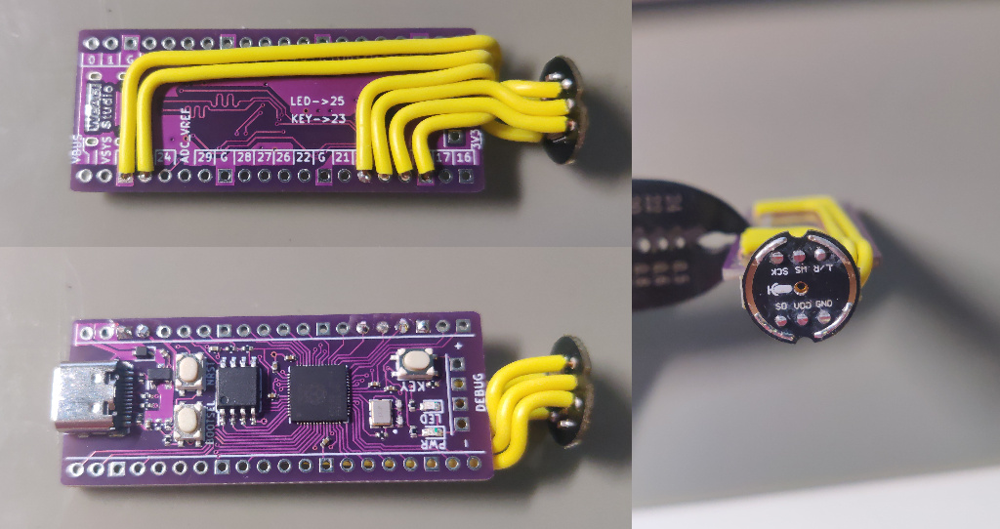

# Pico USB Microphone

A UAC 1.0 microphone implemented on RP2040. This is the firmware binary distribution.

Notable things about firmware:

- act like a UAC 1.0 mono microphone
    - sample rate 48000Hz
    - bit depth 24bit
- USB
    - PID:VID is `c0de:cafe`
    - device serial number is your flash's ID
- pin assignment:
    - GPIO18: I2S bit clock/SCK
    - GPIO19: I2S word select/WS
    - GPIO20: I2S data
    - GPIO25: LED(high active) for recording status
- support I2S microphones with 32bit word size and 24bit precision
    - example device: INMP441(which is discontinued so NOT recommended unless it's cheap enough :D)
    - only left channel(word select low) is used
- there's no ANC, AGC, or AEC, just raw PCM data from the I2S microphone
- implemented using rust with [Embassy](https://github.com/embassy-rs/embassy)
- tested on Linux and Windows 10
    - my Windows 7 VM(virtual box) also recognizes it but the VM is stuck after mic unpluged

## How it works

- I2S implemented with PIO assembly compiled at runtime.
- Embassy as runtime, including support for USB stack, task management, etc..

## Extending the capability

RP2040 can easily do 8-channel 16bit I2S recording at 48000Hz/16bit and send the PCM data through USB. The delay between first and last/4th channels pair(a pair means L/R channel for one 3-wire I2S interface) is about 590ns(about 2 bit clock cycle).

USB full-speed peripheral is the bottle neck here(12Mb but usable is below or equal to 8.2Mb). PIO I2S can handle *a lot*, more than 8 channels.

## Source code?

No. This is not an open-source project yet, but surely an open-idea project :)

Questions are welcomed.

